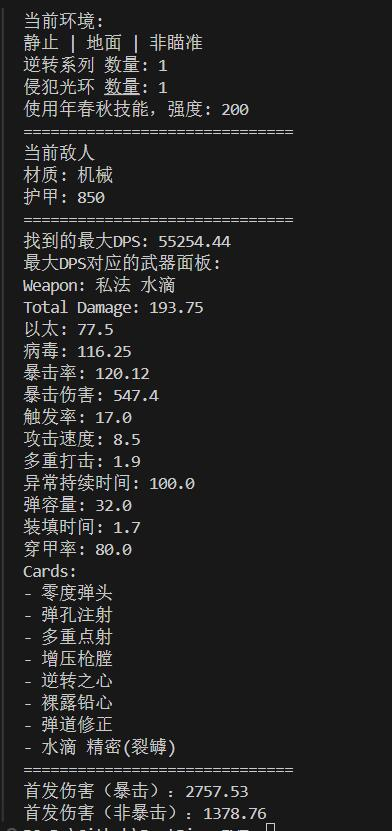

# BestRivenIVT: 《驱入虚空》自动化配卡工具

[English](Readme_en.md) | [中文](Readme.md)

## 概述
本项目旨在为《驱入虚空》游戏开发一个自动化配卡工具，通过算法在特定环境和敌人情况下，寻找使武器DPS最大化的MOD组合最优解。通过遍历所有可能的MOD组合并计算伤害输出，为玩家提供数据驱动的配卡方案。

## 依赖库
- numpy
- unittest

## 用法

可参考seek.py。

假设此时我有一张紫卡，属性如下：

水滴的使用者是年春秋，年春秋的配卡如下：

根据配卡调整环境设置，并且将目标紫卡设置到武器上之后，即可运行脚本。

运行该脚本后计算出的最优DPS和最佳MOD搭配如下：

以下是按照该配卡在训练场的效果（射击时并未移动，角色滑铲是因为截图热键的缘故），此处的计算出的非暴击对应1级暴击、计算出的暴击对应2级暴击，较好地符合了验算结果。

## TODO 列表
- [✅] 直接伤害计算公式
- [✅] DoT伤害计算公式
- [✅] 元素触发与增伤影响
- [✅] 遍历组合并寻求最优解
- [❌] 使用OCR读取游戏
- [❌] 实现GUI界面
- [❌] 完善步枪外的配卡数据
- [❌] 完善所有枪械数据
- [❌] 增加1.2版本空中系列卡牌伤害计算公式