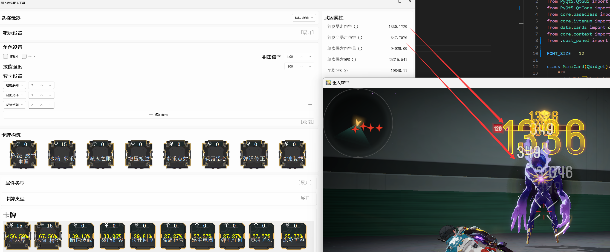

# BestRivenIVT: Automated Modding Tool for 'Into the Void'

[English](Readme_en.md) | [中文](Readme.md)

## Overview
This project is designed for the game 'Into the Void' to provide an automated modding tool. It seeks the optimal MOD combination that maximizes weapon DPS under specific environments and enemies by algorithmically evaluating all possible configurations.

## Dependencies
- numpy
- unittest
- PyQt5
- qfluentwidgets

## Usage

1. Add custom Riven Mods on the "Riven Mod" page.
2. On the "Weapon Build" page, select a weapon and set environmental factors such as the target and character.
3. You can then preview the damage increase effect of each MOD in the current build below.

Here is a preview of the software:

## TODO List
- [✅] Direct damage calculation formula
- [✅] DoT damage calculation formula
- [✅] Elemental trigger and damage bonus effects
- [✅] Traverse combinations and seek optimal solution
- [✅] Implement GUI interface
- [❌] Use OCR to read game data
- [❌] Complete modding data for non-rifle weapons
- [❌] Complete data for all firearm types
- [❌] Add damage formula for aerial series cards (v1.2)